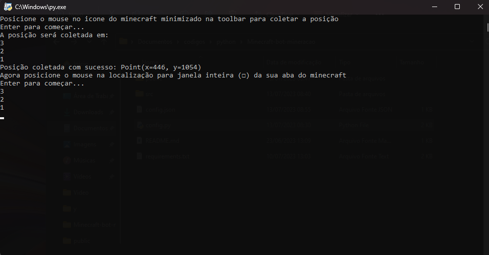
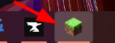
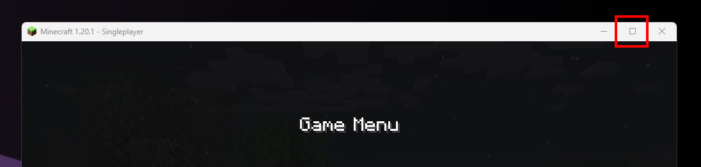
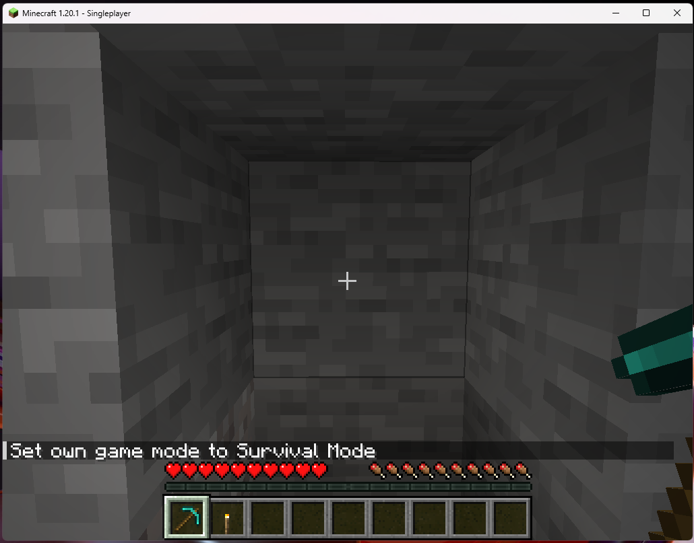
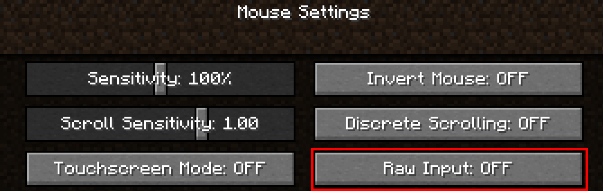

# Bot de mineração automática
Este projeto consiste em um programa que ao ser ligado começar a minerar para frente no minecraft automaticamente, mas ao se deparar com lava, ele faz a meia volta e continua para outro lado


## Tecnologias

Estas são as tecnologias utilizadas no projeto:

* Python versão 3.11
* Pyautogui - controle do mouse, teclado e tela automatizados
* Tensorflow - execução de um modelo de IA para reconhecimento da lava na tela
* Teachable Machine - treinamento do modelo da IA


## Instalação

1 - Instale o python3 pelo site: https://www.python.org/downloads/

2 - Execute o seguinte comando no seu terminal:
   
```sh
git clone https://github.com/ppkat/Minecraft-bot-mineracao.git
```

3 - Instale as dependências abrindo o a pasta do projeto e executando o comando:

```
pip install -r requirements.txt
```

## Como utilizar

Primeiro é necessário configurar o programa para que ele abra o seu minecraft corretamente

### 1 - Execute o arquivo "config.py" com o cmd


### 2 - Você vai receber as instruções para coletar a posição dos ícones na sua tela



### 3 - Primeiramente será pedido para que você posicione seu mouse no ícone minimizado do minecraft



### 4 - A próxima posição a ser coletada será o ícone para expandir a janela do minecraft. Então deixe seu minecraft no modo janela e colete a posição solicitada



### 5 - Agora que o bot ja está configurado, você deve deixar o seu personagem posicionado olhando para frente e reto em direção a parede que você quer minerar em linha reta antes de iniciar o bot



### 6 - Uma última configuração que deve ser aplicada ao minecraft para que ele funcione é o "raw input" que deve estar "off".
Para acessá-la basta ir em Options > Controls > Mouse settings... > Raw Input



### 7 - Pronto, agora minimize o seu minecraft e execute o arquivo index.py, dentro da pasta src/

## Funcionamento

O bot vai começar a quebrar para frente e alternar a tela olhando para baixo e para cima, para quebrar em 2x1 e depois de quebrar, ele anda:


A cada ciclo de quebrar um bloco de baixo e um de cima, ele vai verificar lava antes de andar pra frente novamente, e caso ele encontre, ele fará meia volta:


## Versão

  1.0.0.0

## Autores

* **João Pedro Gaspar Pereira** 

Por favor siga o github e de uma star se gostou do projeto!

Obrigado pela visita!
